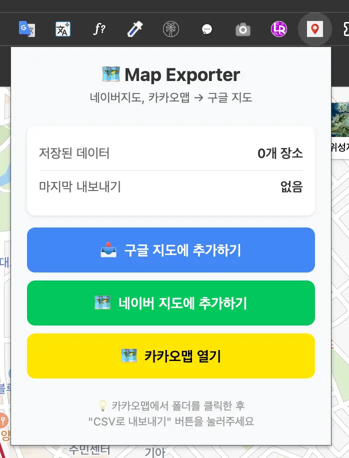
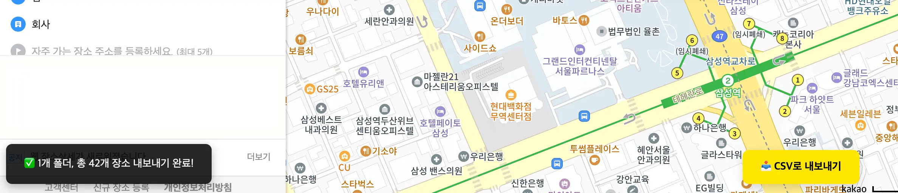
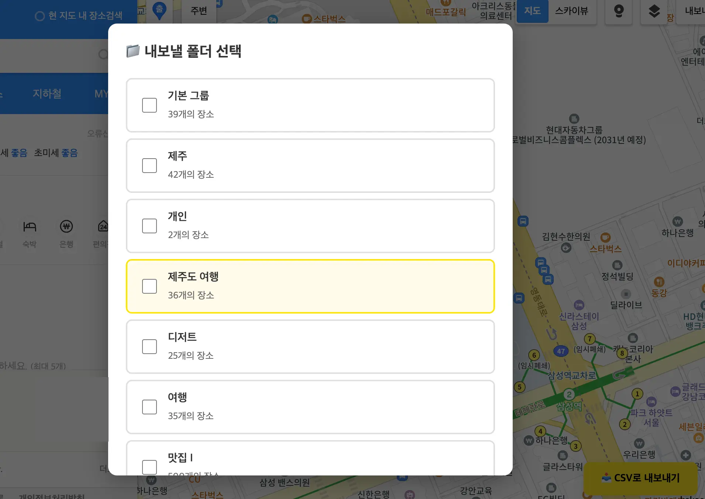
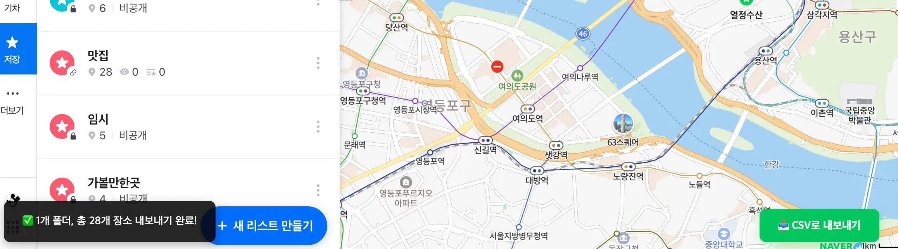
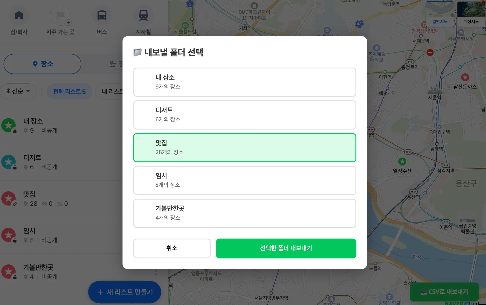
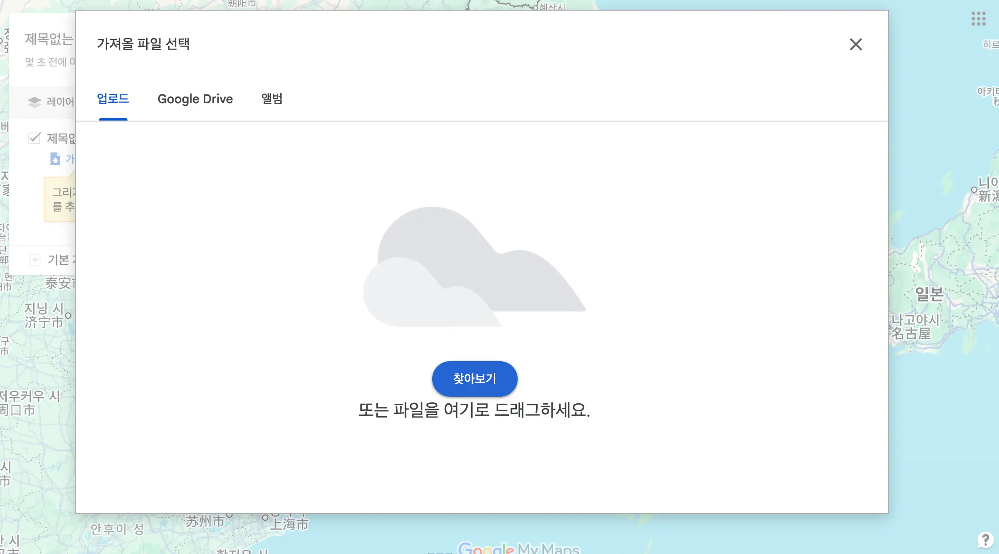

# 📍 MapNomad (맵노마드)

> **Breaking Boundaries Between Maps.** > 국내 지도 서비스(카카오, 네이버)의 데이터를 추출하여 구글 지도 등 전 세계 어디서든 사용할 수 있게 만드는 크롬 확장 프로그램입니다.

## 1. 프로젝트 비전 (Vision)

특정 지도 서비스의 폐쇄적인 생태계에서 당신의 소중한 '장소 데이터'를 해방시킵니다. **MapNomad**는 플랫폼에 종속되지 않는 독립적인 데이터 주권을 지향하며, 사용자가 어디로 이동하든 자신의 지도를 지속적으로 관리할 수 있는 환경을 제공합니다.

---

## 2. 🚀 주요 기능 (Features)

* **플랫폼 통합 내보내기**: 카카오맵 및 네이버 지도의 즐겨찾기 데이터를 범용적인 CSV 형식으로 추출합니다.
* **유연한 데이터 선택**: 전체 데이터뿐만 아니라 폴더별 선택 내보내기를 지원합니다.
* **구글 지도 즉시 호환**: 추출된 CSV는 'Google 내 지도(My Maps)'의 표준 포맷과 완벽히 호환되어 즉시 업로드 가능합니다.
* **다중 폴더 병합**: 여러 폴더에 흩어진 장소를 한 번에 모아서 관리할 수 있습니다.

---

## 3. 🛠️ 기술 스택 (Tech Stack)

* **Framework**: [WXT](https://wxt.dev/) (Modern Web Extension Framework)
* **Build Tool**: Vite
* **Manifest**: Chrome Extension Manifest V3
* **Language**: JavaScript

---

## 4. 📦 설치 및 개발 (Installation)

### 개발자 모드 실행

```bash
# 의존성 설치
npm install

# 개발 서버 시작 (Hot Reload 지원)
npm run dev

# 프로덕션 빌드 및 압축
npm run build
npm run zip

```

### 확장 프로그램 로드

1. 크롬 브라우저에서 `chrome://extensions` 접속
2. 우측 상단 **"개발자 모드"** 활성화
3. **"압축해제된 확장 프로그램을 로드합니다"** 클릭
4. 프로젝트 경로의 `.output/chrome-mv3` (프로덕션) 또는 `.output/chrome-mv3-dev` (개발) 폴더 선택

---

## 🎯 사용 방법 (Usage)

### 확장 프로그램 팝업

확장 프로그램 아이콘을 클릭하면 다음과 같은 메뉴가 나타납니다.



---

### 1단계: 국내 지도에서 데이터 추출

#### 카카오맵에서 내보내기

1. **카카오맵 즐겨찾기 페이지 접속**
   
   팝업에서 "🗺️ 카카오맵 열기" 버튼을 클릭하거나 [카카오맵 즐겨찾기](https://map.kakao.com/favorite/list) 페이지로 직접 이동합니다.

2. **페이지 새로고침 및 내보내기 버튼 클릭**
   
   페이지를 새로고침(F5)하면 우측 하단에 **"📥 CSV로 내보내기"** 버튼이 나타납니다.
   
   

3. **폴더 선택 및 내보내기**
   
   내보낼 폴더를 선택합니다. 여러 폴더를 동시에 선택할 수 있습니다.
   
   

#### 네이버 지도에서 내보내기

1. **네이버 지도 저장 페이지 접속**
   
   팝업에서 "🗺️ 네이버 지도에 추가하기" 버튼을 클릭하거나 [네이버 지도 저장](https://map.naver.com/p/my) 페이지로 직접 이동합니다.

2. **페이지 새로고침 및 내보내기 버튼 클릭**
   
   페이지를 새로고침(F5)하고 우측 하단의 **"📥 CSV로 내보내기"** 버튼을 클릭합니다.
   
   

3. **폴더 선택 및 내보내기**
   
   원하는 폴더를 선택하고 "선택한 폴더 내보내기" 버튼을 클릭합니다.
   
   

---

### 2단계: 구글 지도에 적용

1. **Google 내 지도 접속 및 CSV 파일 가져오기**
   
   [Google 내 지도](https://www.google.com/maps/d/) 접속 후 **"새 지도 만들기"** 클릭, 레이어에서 **"가져오기"**를 선택하여 MapNomad가 생성한 CSV 파일을 업로드합니다.
   
   

2. **완료!**
   
   국내 지도 서비스의 데이터가 구글 지도에 성공적으로 이전되었습니다.

---

## 📁 프로젝트 구조 (Project Structure)

```
map-nomad/
├── entrypoints/
│   ├── popup/               # 확장 프로그램 팝업 UI 및 로직
│   ├── kakao.content.js     # 카카오맵 데이터 주입 스크립트
│   └── naver.content.js     # 네이버 지도 데이터 주입 스크립트
├── public/
│   ├── injected/            # 실제 페이지에 실행될 인젝션 스크립트
│   └── icon-*.png           # MapNomad 공식 핀 아이콘
├── wxt.config.js            # WXT 설정 파일
└── package.json

```

---

## 📝 데이터 포맷 (Data Format)

MapNomad는 아래와 같은 표준화된 인터페이스를 통해 데이터의 상호 운용성을 보장합니다.

| Name | Address | Latitude | Longitude | Description | URL |
| --- | --- | --- | --- | --- | --- |
| 장소명 | 주소 | 위도 | 경도 | 메모 | 원본 링크 |

> **Technical Note:**
> - **UTF-8 BOM 지원**: 생성된 CSV 파일은 UTF-8 BOM 인코딩을 사용하여 엑셀(Excel)에서도 한글이 깨지지 않습니다.
> - **폴더별 필터링**: 사용자가 선택한 폴더의 데이터만 정확하게 추출하여 개별 CSV 파일로 저장합니다.

---

## ⚖️ Disclaimer & Ethics
- **MapNomad**는 사용자의 '데이터 주권'을 존중합니다. 플랫폼에 저장된 본인의 데이터를 자유롭게 백업하고 관리할 수 있도록 돕는 도구입니다.
- 본 도구는 서버로 어떠한 데이터도 전송하지 않으며, 모든 변환 및 추출 과정은 사용자의 브라우저(Local)에서 즉시 처리됩니다.
- 본 도구의 사용으로 인해 발생하는 각 지도 서비스의 이용약관 준수 책임은 사용자 본인에게 있습니다. 상업적 용도의 대량 데이터 수집을 지양해 주세요.

---

## ⚠️ 주의사항 (Disclaimer)

* 이 도구는 **개인적인 백업 및 데이터 이관 목적**으로 개발되었습니다.
* 카카오맵 및 네이버 지도의 웹사이트 구조나 API가 변경될 경우 작동하지 않을 수 있습니다.
* 추출된 데이터의 **상업적 이용이나 무단 배포**는 각 서비스의 이용 약관에 위배될 수 있으므로, **개인적인 용도로만 사용**하시기 바랍니다.

---

## 📄 라이선스 (License)

본 프로젝트는 **ISC** 라이선스를 따릅니다.

---

## 💡 향후 개발 방향 (Future Development)

현재 구현된 CSV 형식은 구글 지도에 최적화되어 있으나, 향후 다음과 같은 기능 확장을 고려하고 있습니다:

* **GeoJSON 지원**: 단순한 백업 도구를 넘어 전문적인 GIS(지리정보시스템) 데이터 마이그레이션 도구로 확장
* **다국어 지도 서비스 지원**: Apple Maps, OpenStreetMap 등 추가 플랫폼 지원
* **양방향 동기화**: 구글 지도에서 카카오맵/네이버 지도로의 역방향 데이터 이전
* **자동 백업 스케줄링**: 주기적인 자동 백업 기능

